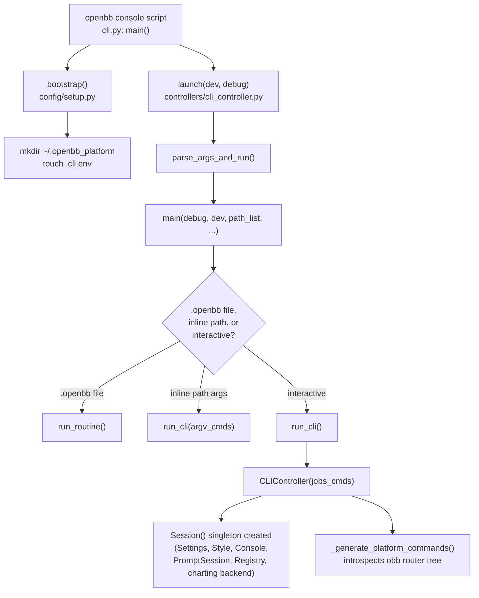
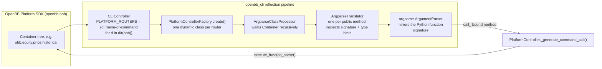

## Subject

Architecture and interactive-console (UI) design of the **OpenBB Platform CLI** (`cli/openbb_cli`), including:

- how its menu tree, command dispatch, and help screens are built and rendered
- which terminal-UI (TUI) library it is built on, and how that compares to [Textual](https://github.com/Textualize/textual)
- the module dependency graph between the CLI layer and the OpenBB Platform SDK (`openbb`, `openbb_core`, `openbb_charting`)

> **Scope note on the `ana` skill template**: the shared `ana` skill instructions ask for Django/Celery-focused coverage (media lifecycle, routing, ORM, task queues). This repository's `cli/openbb_cli` subject has **no Django or Celery involvement** — it is a plain Python console application on top of the OpenBB Platform SDK. This document therefore does not include a Django/Celery section; it replaces that focus with the CLI/TUI-specific coverage the user actually requested.

## Scope / Goals

1. Explain the CLI's process architecture: entry point, bootstrap, the singleton `Session`, and the REPL main loop.
2. Explain how the entire command surface (hundreds of commands across dozens of OpenBB Platform extensions) is generated **reflectively** from the Platform SDK rather than hand-written.
3. Identify the concrete TUI/console libraries in use and precisely characterize the interaction model (line-oriented REPL vs. full-screen widget app).
4. Compare this design to [Textual](https://github.com/Textualize/textual) and explain the likely engineering rationale for the choice.
5. Provide diagrams, configuration points, and troubleshooting entries for future changes to this subsystem.

## Runtime Selection Diagnostics

- runtime_source: auto
- runtime_confidence: 0.97
- runtime_signals: [active-file:pyproject.toml, cli/openbb_cli/*.py, "prompt-toolkit", "rich", argparse, no Django/Celery markers found]
- runtime_switched: false
- runtime_candidates: python:0.97, other:0.03
- clarification_asked: false
- clarification_question: N/A
- clarification_answer: N/A
- cost_impact_note: unambiguous single-language Python console app; no clarification round needed.

## Key Module Map

| Path | Role |
|---|---|
| [cli/pyproject.toml](../cli/pyproject.toml) | Declares the `openbb` console entry point and pins `prompt-toolkit`, `rich`, `pywry`. |
| [cli/openbb_cli/cli.py](../cli/openbb_cli/cli.py) | Process entry point (`main()`), calls `bootstrap()` then `launch()`. |
| [cli/openbb_cli/session.py](../cli/openbb_cli/session.py) | `Session` singleton: owns `Settings`, `Style`, `Console`, `PromptSession`, `Registry`, and the Plotly/`pywry` charting backend. |
| [cli/openbb_cli/config/setup.py](../cli/openbb_cli/config/setup.py) | `bootstrap()`: creates `~/.openbb_platform` and touches the `.cli.env` settings file. |
| [cli/openbb_cli/config/constants.py](../cli/openbb_cli/config/constants.py) | Filesystem layout: settings dir, history file, styles dir, script tags, flair icons. |
| [cli/openbb_cli/config/console.py](../cli/openbb_cli/config/console.py) | `Console`: wraps `rich.console.Console`, optionally boxes help text in a `rich.panel.Panel`. |
| [cli/openbb_cli/config/style.py](../cli/openbb_cli/config/style.py) | `Style`: loads `.richstyle.json` (terminal colors) and `.pltstyle` (Plotly chart colors) from `assets/styles/`. |
| [cli/openbb_cli/config/menu_text.py](../cli/openbb_cli/config/menu_text.py) | `MenuText`: hand-formats fixed-width, bbcode-tagged help screens (not a `rich.table.Table`). |
| [cli/openbb_cli/config/completer.py](../cli/openbb_cli/config/completer.py) | Hand-rolled `NestedCompleter`/`WordCompleter` on top of `prompt_toolkit.completion.Completer`, plus `CustomFileHistory` (redacts `--password`/`--email`/`--pat`). |
| [cli/openbb_cli/controllers/base_controller.py](../cli/openbb_cli/controllers/base_controller.py) | Abstract REPL engine shared by every menu: input parsing, command queueing, common verbs (`help`, `home`, `quit`, `reset`, `record`/`stop`, `results`). |
| [cli/openbb_cli/controllers/cli_controller.py](../cli/openbb_cli/controllers/cli_controller.py) | Root menu (`/`). Introspects `obb` (the Platform SDK root) to build top-level menus/commands; hosts the main `run_cli()` loop and `.openbb` routine execution (`exe`). |
| [cli/openbb_cli/controllers/platform_controller_factory.py](../cli/openbb_cli/controllers/platform_controller_factory.py) | `PlatformControllerFactory`: dynamically synthesizes a controller **class** (via `type(...)`) per Platform router. |
| [cli/openbb_cli/controllers/base_platform_controller.py](../cli/openbb_cli/controllers/base_platform_controller.py) | `PlatformController`: generates one `call_<command>` method per Platform SDK function, executes it, and renders/exports/registers the result. |
| [cli/openbb_cli/controllers/settings_controller.py](../cli/openbb_cli/controllers/settings_controller.py) | `/settings` menu: toggles the `Settings` feature flags at runtime. |
| [cli/openbb_cli/controllers/script_parser.py](../cli/openbb_cli/controllers/script_parser.py) | Parses `.openbb` routine script text into a command queue. |
| [cli/openbb_cli/controllers/choices.py](../cli/openbb_cli/controllers/choices.py) | Builds the completer's choice map by monkey-patching each command's argument parser hook to harvest its flags without executing the command. |
| [cli/openbb_cli/argparse_translator/argparse_translator.py](../cli/openbb_cli/argparse_translator/argparse_translator.py) | `ArgparseTranslator`: reflects over one Python function's signature/type hints and builds a matching `argparse.ArgumentParser`. |
| [cli/openbb_cli/argparse_translator/argparse_class_processor.py](../cli/openbb_cli/argparse_translator/argparse_class_processor.py) | `ArgparseClassProcessor`: walks an OpenBB Platform router `Container` recursively, building one `ArgparseTranslator` per public method. |
| [cli/openbb_cli/argparse_translator/obbject_registry.py](../cli/openbb_cli/argparse_translator/obbject_registry.py) | `Registry`: an in-memory stack of `OBBject` results, addressable by index (`OBB0`) or a user-chosen key, feeding downstream data-processing commands. |
| [cli/openbb_cli/models/settings.py](../cli/openbb_cli/models/settings.py) | `Settings` (Pydantic `BaseModel`): feature flags and preferences, persisted to a dotenv file. |

## Core Architecture

### 1. Process bootstrap



### 2. Interaction model: a hierarchical REPL, not a full-screen app

The CLI is architecturally a **line-oriented, hierarchical shell** — closer in spirit to a Cisco IOS CLI, `ipython`, or a hand-rolled `cmd`/`cmd2` shell than to a full-screen dashboard:

- Every "menu" (e.g. `/equity/`, `/equity/price/`) is a Python object (`BaseController` subclass) with its own `argparse.ArgumentParser`, its own completer, and its own `menu()` loop ([cli/openbb_cli/controllers/base_controller.py:919](../cli/openbb_cli/controllers/base_controller.py#L919)).
- Navigation is expressed as `/`-delimited command chains (e.g. `/equity/price/historical --symbol AAPL`) that get tokenized once by `parse_and_split_input` and pushed onto a per-controller `queue` list, drained one command at a time ([cli/openbb_cli/controllers/base_controller.py:197](../cli/openbb_cli/controllers/base_controller.py#L197)).
- The terminal is **never** switched to an alternate screen buffer, and there is no persistent widget tree: each command prints its result once (a Rich `Panel`/table/text) and that output remains in normal scrollback, exactly like a shell.
- Charts do not render inside the terminal at all — they are handed off to a separate `pywry`-backed desktop window via `OpenBBFigure`/the charting backend created in `Session._get_backend()` ([cli/openbb_cli/session.py:22](../cli/openbb_cli/session.py#L22)). Large tables can optionally pop into an interactive dataframe viewer (`USE_INTERACTIVE_DF`) instead of printing inline.

### 3. Reflection-driven command generation (the core design idea)

The single most important architectural fact about this CLI: **almost no command is hand-written**. Every menu and every flag is derived at runtime by introspecting the OpenBB Platform SDK's `obb` object tree (`openbb_core.app.static.container.Container`).



Concretely:

1. `CLIController` builds `PLATFORM_ROUTERS = {d: "menu" if not isinstance(getattr(obb, d), BaseModel) else "command" for d in dir(obb)}` at class-definition time ([cli/openbb_cli/controllers/cli_controller.py:50](../cli/openbb_cli/controllers/cli_controller.py#L50)) — this is what decides whether `equity`, `news`, `technical`, etc. become sub-menus or single commands.
2. For every menu router, `PlatformControllerFactory(target, reference=obb.reference["paths"]).create()` synthesizes a **new Python class** at runtime via `type(ClassName, (PlatformController,), Attributes)` ([cli/openbb_cli/controllers/platform_controller_factory.py:29](../cli/openbb_cli/controllers/platform_controller_factory.py#L29)) — there is no `EquityController.py` file; the class is manufactured in memory.
3. `ArgparseClassProcessor` walks the router recursively with `inspect.getmembers`, and for every public bound method, and for every nested `Container` attribute, wraps it in an `ArgparseTranslator` ([cli/openbb_cli/argparse_translator/argparse_class_processor.py:84](../cli/openbb_cli/argparse_translator/argparse_class_processor.py#L84)).
4. `ArgparseTranslator` reads the target function's `inspect.signature()` and `get_type_hints()` and builds a matching `argparse.ArgumentParser`: `Literal[...]` types become `choices=`, `list[...]` becomes `nargs="+"`, `Optional[bool]`/`bool` becomes `action="store_true"`, and `Annotated[..., OpenBBField(description=..., choices=...)]` supplies help text and custom choices ([cli/openbb_cli/argparse_translator/argparse_translator.py:187](../cli/openbb_cli/argparse_translator/argparse_translator.py#L187)). Pydantic `BaseModel` parameters are flattened into `--param__field` dotted-style flags and reassembled before the call ([cli/openbb_cli/argparse_translator/argparse_translator.py:320](../cli/openbb_cli/argparse_translator/argparse_translator.py#L320)).
5. At execution time, `PlatformController._generate_command_call()` binds a closure as `call_<name>` that parses the line, calls `translator.execute_func(ns_parser)` (which calls the **original, unmodified** Platform SDK function), receives an `OBBject`, and renders it via `print_rich_table`, an interactive dataframe view, or a popped-out chart — optionally registering the `OBBject` into `session.obbject_registry` so later commands can reference it as `OBB0` or a custom `--register_key` ([cli/openbb_cli/controllers/base_platform_controller.py:151](../cli/openbb_cli/controllers/base_platform_controller.py#L151)).

A full call trace for `/equity/price/historical --symbol AAPL` is in [tui-cli-ANALYSIS-2026-08-03-sequence.puml](tui-cli-ANALYSIS-2026-08-03-sequence.puml). The static class relationships are in [tui-cli-ANALYSIS-2026-08-03-class.puml](tui-cli-ANALYSIS-2026-08-03-class.puml).

### 4. Rendering pipeline (Rich)

- `Console` ([cli/openbb_cli/config/console.py:16](../cli/openbb_cli/config/console.py#L16)) wraps `rich.console.Console` and, for menu/help text, boxes it in a `rich.panel.Panel` titled with the current menu path and subtitled with the CLI version — unless `ENABLE_RICH_PANEL` is off or `TEST_MODE` is on, in which case it falls back to a bare `print()` with the custom bbcode tags (`[menu]`, `[cmds]`, `[info]`, `[src]`, `[help]` — see `RICH_TAGS` in [cli/openbb_cli/config/menu_text.py:13](../cli/openbb_cli/config/menu_text.py#L13)) stripped out.
- `MenuText` ([cli/openbb_cli/config/menu_text.py:29](../cli/openbb_cli/config/menu_text.py#L29)) does **not** use `rich.table.Table` for the help screen; it hand-pads command names/descriptions to fixed widths (`CMD_NAME_LENGTH=23`, `CMD_DESCRIPTION_LENGTH=65`) and wraps them in bbcode tags that a `rich.console.Theme` (built from a `.richstyle.json` file) maps to colors. The whole "menu screen" is one large pre-formatted multi-line string handed to `Console.print()`.
- `Style` ([cli/openbb_cli/config/style.py:15](../cli/openbb_cli/config/style.py#L15)) serves **two** different rendering backends from the same theme concept: `.richstyle.json` files style terminal text (Rich), and `.pltstyle` files style Plotly charts (colorway, up/down colors) rendered in the separate `pywry` window — one `Style` abstraction, two unrelated renderers.

### 5. Input pipeline (prompt_toolkit)

- `Session._get_prompt_session()` creates a `prompt_toolkit.PromptSession` **only if `sys.stdin.isatty()`** ([cli/openbb_cli/session.py:86](../cli/openbb_cli/session.py#L86)); otherwise `prompt_session` is `None` and every controller falls back to builtin `input()` with no completion or history. This single check is what makes piped/non-interactive execution (CI, `.openbb` routine replay, integration tests) work through the exact same code path as interactive use.
- Command-line editing, history (`CustomFileHistory`, which redacts `--password`/`--email`/`--pat` before writing to `~/.openbb_platform/.cli.his`), and Tab-completion all come from `prompt_toolkit`; there is no alternate-screen layout, no mouse handling, and no persistent widgets — `PromptSession.prompt()` is called once per line, synchronously, exactly like a classic REPL.
- Completion choices are **not** static: `NestedCompleter`/`WordCompleter` ([cli/openbb_cli/config/completer.py:26](../cli/openbb_cli/config/completer.py#L26)) is a from-scratch reimplementation (API-shaped like `prompt_toolkit`'s own `NestedCompleter` but with extra bookkeeping for already-consumed flags and short/long flag aliases). For Platform commands, the actual flag choices are harvested by `controllers/choices.py`'s `build_controller_choice_map`, which **monkey-patches** `parse_known_args_and_warn`/`parse_simple_args` with `unittest.mock.patch.object` and calls each `call_<cmd>` with empty arguments purely to intercept the `argparse.ArgumentParser` it builds internally — the real command logic never executes ([cli/openbb_cli/controllers/choices.py:244](../cli/openbb_cli/controllers/choices.py#L244)).

### 6. Automation: `.openbb` routine scripts

`record`/`stop` ([cli/openbb_cli/controllers/base_controller.py:315](../cli/openbb_cli/controllers/base_controller.py#L315)) capture every line typed in a session and write them to a `.openbb` text file (or upload to OpenBB Hub). `exe` and `run_scripts()` ([cli/openbb_cli/controllers/cli_controller.py:326](../cli/openbb_cli/controllers/cli_controller.py#L326)) read such a file back, join its lines into one `/`-delimited command chain, and feed it through the **same** `switch()`/`queue` engine used for interactive typing. In other words, "automation" is literal keystroke replay through the REPL parser, not a separate scripting API or DSL interpreter.

## Key Data Models (descriptive only)

- **`Settings`** ([cli/openbb_cli/models/settings.py:22](../cli/openbb_cli/models/settings.py#L22)) — a Pydantic `BaseModel` of feature flags (`USE_PROMPT_TOOLKIT`, `ENABLE_RICH_PANEL`, `TOOLBAR_HINT`, `USE_INTERACTIVE_DF`, …) and preferences (`TIMEZONE`, `FLAIR`, `RICH_STYLE`, `N_TO_KEEP_OBBJECT_REGISTRY`, …). A `model_validator(mode="before")` loads existing values from the dotenv file at `~/.openbb_platform/.cli.env` on every construction; `set_item()` writes both the in-memory attribute and the dotenv key, so toggles made in the `/settings` menu persist across restarts.
- **`Registry` / `OBBject` stack** ([cli/openbb_cli/argparse_translator/obbject_registry.py:9](../cli/openbb_cli/argparse_translator/obbject_registry.py#L9)) — an in-process, non-persistent stack (most-recent-first) of `OBBject` results, bounded by `N_TO_KEEP_OBBJECT_REGISTRY`. Entries are addressable by stack index (`OBB0`, `OBB1`, …) or an optional user-supplied `--register_key`, and are what lets `technical`/`quantitative`/`econometrics` commands operate on a previous command's output without re-fetching data.
- **`ArgparseTranslator`/`ArgparseClassProcessor`** artifacts are **not persisted** — they are rebuilt from the live OpenBB Platform SDK on every CLI process start, so the command surface always matches whatever Platform extensions are installed in the current environment (no static command manifest to keep in sync).

## TUI Library: `prompt_toolkit` + `rich` (not Textual)

### What the CLI actually uses

Confirmed directly from [cli/pyproject.toml](../cli/pyproject.toml):

```toml
dependencies = [
    "openbb[all]",
    "prompt-toolkit>=3.0.50,<4.0.0",
    "rich>=14.0.0,<15.0.0",
    "python-dotenv>=1.0.1,<2.0.0",
    "openpyxl>=3.1.5,<4.0.0",
    "pywry>=0.6.2,<0.7.0",
]
```

- **`prompt_toolkit`** — used only at its **line-editing** layer: `PromptSession.prompt()` for a single line of input, `Completer`/`Completion` for Tab-completion, `FileHistory` for command history, `Style`/`HTML` for the one-line bottom toolbar. The lower-level `prompt_toolkit.layout`/full-screen `Application` API (the part of `prompt_toolkit` that *can* build a full-screen app) is **not used anywhere** in this codebase.
- **`rich`** — used only for **one-shot render-and-return** output: `rich.console.Console.print()`, `rich.panel.Panel`, `rich.table.Table` (in `print_rich_table`), `rich.console.Theme`. Rich never owns the terminal or maintains a persistent frame; every call renders once and returns control to the shell's normal scrollback.
- **`pywry`** — a separate, non-terminal desktop window backend used only for Plotly chart popups (`OpenBBFigure`), not part of the terminal UI at all.

There is **no Textual dependency anywhere in `cli/pyproject.toml` or `cli/openbb_cli/`**.

### How this differs from Textual

| Dimension | OpenBB CLI (`prompt_toolkit` + `rich`) | [Textual](https://github.com/Textualize/textual) |
|---|---|---|
| Screen model | Normal scrollback buffer; every command appends output like a shell | Alternate screen buffer; a persistent, redrawn frame |
| UI unit | One `argparse.ArgumentParser` + one Rich renderable per command, printed once | A tree of long-lived `Widget`s (buttons, tables, trees, inputs) with CSS-like styling |
| Update model | Render-once, stateless per command | Reactive: widgets re-render on state change, animations, async message-passing |
| Input model | Single-line `PromptSession.prompt()` per turn, blocking | Full keyboard/mouse event loop, focus management, bindings across widgets |
| Piping / redirection | Works unmodified — same normal stdout stream users can `> file`, `| less`, or scroll back through | Not meaningful in the same way — the alternate screen is not intended for scrollback/redirection |
| Non-interactive / headless execution | Falls back to builtin `input()` automatically when `stdin` is not a TTY ([cli/openbb_cli/session.py:86](../cli/openbb_cli/session.py#L86)); `.openbb` scripts replay through the identical code path | Requires the separate `Pilot`/headless-testing API to drive without a real terminal |
| Command-surface scaling | Argparse trees are generated straight from Python function signatures via reflection — near-zero authoring cost per new Platform SDK endpoint | Each screen/form is normally hand-authored as a widget layout; there is no direct signature-to-widget code-gen equivalent |
| Mouse / clickable widgets | None — everything is line input; charts pop out to a separate `pywry` window instead of rendering in-terminal | First-class: buttons, clickable rows, scrollable panes, live dashboards |
| Maintenance cost of the console layer itself | A bespoke ~400-line `NestedCompleter`/`WordCompleter` plus hand-padded `MenuText` — team-maintained, non-trivial state tracking | Framework-maintained layout/widget/reactivity system, but a larger framework surface to learn and depend on |

### Why this design (inferred from the codebase, not from external history)

1. **Command surface is reflection-generated, and argparse is the natural target for that reflection.** The entire menu tree is produced by inspecting Python function signatures (`inspect.signature`, `get_type_hints`) and turning them into `argparse.ArgumentParser` instances ([cli/openbb_cli/argparse_translator/argparse_translator.py:320](../cli/openbb_cli/argparse_translator/argparse_translator.py#L320)). Argparse's declarative, flag-based model maps almost 1:1 onto a Python function signature. There is no equally direct signature-to-widget mapping in a full-screen framework — each Textual screen would need to be authored (or code-generated with new tooling) as a widget layout instead of a parser.
2. **Scrollback-preserving output is a functional requirement for a data-research terminal.** Because Rich renders once per command into the normal buffer, users retain a scrollable transcript of every table/result they've pulled in a session — exactly what `results`/the `Registry` stack relies on conceptually (referencing "the 3rd table back" as `OBB2`). A Textual app's alternate screen is not designed for that same scrollback-and-reference pattern.
3. **The heavy, visual part of the product (charts, large interactive tables) is deliberately pushed *outside* the terminal** to a `pywry` desktop window ([cli/openbb_cli/session.py:22](../cli/openbb_cli/session.py#L22)) or an interactive dataframe viewer, rather than rendered as in-terminal widgets. Given that split, the terminal side only ever needs "styled static text + line editing," which is exactly what Rich + prompt_toolkit provide — the terminal was never meant to be the persistent visual surface a Textual app would want to own.
4. **Non-interactive execution must be a first-class mode, not a special case.** `.openbb` routine scripts, CI integration tests, and piped input all degrade to the same `input()`-based loop with zero code branching for "headless mode" ([cli/openbb_cli/session.py:86](../cli/openbb_cli/session.py#L86), [cli/openbb_cli/controllers/cli_controller.py:657](../cli/openbb_cli/controllers/cli_controller.py#L657)). Building the same guarantee on top of a full-screen Textual `App` would require its separate headless/`Pilot` testing model rather than "just call the same function with piped stdin."
5. **Trade-off accepted**: this design gives up mouse interaction, live-updating dashboards, and a framework-maintained widget/layout system, in exchange for a shell-like, scriptable, scrollback-friendly REPL whose entire command surface can be regenerated for free every time a new OpenBB Platform extension is installed. That trade only makes sense because the product's actual UI needs are "argument parsing + styled text + occasional external chart window," not "a persistent on-screen dashboard" — which is the case this codebase implements.

## Key Configuration Points

| Setting / Path | Location | Effect |
|---|---|---|
| `~/.openbb_platform/.cli.env` | [cli/openbb_cli/config/constants.py:12](../cli/openbb_cli/config/constants.py#L12) | Dotenv-persisted `Settings` (feature flags, preferences); each key is prefixed `OPENBB_`. |
| `~/.openbb_platform/.cli.his` | [cli/openbb_cli/config/constants.py:13](../cli/openbb_cli/config/constants.py#L13) | Prompt history file (`CustomFileHistory`), with `--password`/`--email`/`--pat` values redacted before write. |
| `assets/styles/{default,user}/*.richstyle.json` | [cli/openbb_cli/config/style.py:83](../cli/openbb_cli/config/style.py#L83) | Terminal color themes (`RICH_STYLE` setting selects one, default `"dark"`). |
| `Settings.USE_PROMPT_TOOLKIT` | [cli/openbb_cli/models/settings.py:71](../cli/openbb_cli/models/settings.py#L71) | Toggles completion/history entirely; off ⇒ falls back to builtin `input()` even on a real TTY. |
| `Settings.ENABLE_RICH_PANEL` | [cli/openbb_cli/models/settings.py:83](../cli/openbb_cli/models/settings.py#L83) | Toggles the bordered `Panel` wrapper vs. plain `print()` for menu/help text. |
| `Settings.TOOLBAR_HINT` | [cli/openbb_cli/models/settings.py:89](../cli/openbb_cli/models/settings.py#L89) | Toggles the bottom one-line key-binding hint bar in `BaseController.menu()` ([cli/openbb_cli/controllers/base_controller.py:966](../cli/openbb_cli/controllers/base_controller.py#L966)). |
| `Settings.N_TO_KEEP_OBBJECT_REGISTRY` / `N_TO_DISPLAY_OBBJECT_REGISTRY` | [cli/openbb_cli/models/settings.py:115](../cli/openbb_cli/models/settings.py#L115) | Bounds the `Registry` stack size and how many cached results are shown on the help screen. |
| `--dev` CLI flag | [cli/openbb_cli/controllers/cli_controller.py:933](../cli/openbb_cli/controllers/cli_controller.py#L933) | Points `HUB_URL`/`BASE_URL` at OpenBB's dev backend instead of production. |
| `-d` / `--debug` CLI flag | [cli/openbb_cli/controllers/cli_controller.py:844](../cli/openbb_cli/controllers/cli_controller.py#L844) | Surfaces unknown CLI args and raw exceptions instead of silently exiting/swallowing them. |

## Common Failure Cases and Troubleshooting Entry Points

| Symptom | Likely cause | Where to look |
|---|---|---|
| No Tab-completion / no history, even in a real terminal | `Settings.USE_PROMPT_TOOLKIT` is `False`, or `sys.stdin.isatty()` returned `False` (e.g. running under a wrapper that redirects stdin) | [cli/openbb_cli/session.py:86](../cli/openbb_cli/session.py#L86) `_get_prompt_session()` |
| A new OpenBB Platform extension's commands don't appear in the CLI | The extension isn't installed into the same environment as `openbb-cli`, so `dir(obb)` never surfaces it, or the router only exposes private/`_`-prefixed methods that `ArgparseClassProcessor` skips | [cli/openbb_cli/argparse_translator/argparse_class_processor.py:91](../cli/openbb_cli/argparse_translator/argparse_class_processor.py#L91) |
| A command's flag doesn't Tab-complete choices correctly | `build_controller_choice_map`'s monkey-patch in `choices.py` failed to intercept exactly one parser call for that command (raises/records an `AssertionError` in `DEBUG_MODE`) | [cli/openbb_cli/controllers/choices.py:244](../cli/openbb_cli/controllers/choices.py#L244) `_get_argument_parser()` |
| `results`/`OBB<n>` references stop working mid-session | `Registry` evicted the oldest entry after `N_TO_KEEP_OBBJECT_REGISTRY` was exceeded, or the command never set `store_obbject`/`register_obbject` | [cli/openbb_cli/argparse_translator/obbject_registry.py:60](../cli/openbb_cli/argparse_translator/obbject_registry.py#L60) `remove()`; [cli/openbb_cli/controllers/base_platform_controller.py:182](../cli/openbb_cli/controllers/base_platform_controller.py#L182) |
| A `.openbb` routine plays back differently than when recorded | Routine scripts are literal command-string replay; changes to Platform SDK defaults, provider availability, or menu structure between record time and replay time change behavior | [cli/openbb_cli/controllers/cli_controller.py:657](../cli/openbb_cli/controllers/cli_controller.py#L657) `run_scripts()`; [cli/openbb_cli/controllers/script_parser.py](../cli/openbb_cli/controllers/script_parser.py) |
| Chart never appears / errors about a backend | Charts render via a separate `pywry` desktop process, not in-terminal; check `Session._get_backend()` and whether a display/GUI backend is available in the current environment (e.g. headless CI) | [cli/openbb_cli/session.py:22](../cli/openbb_cli/session.py#L22) |
| Sensitive values (password/email/PAT) unexpectedly visible | Only `--password`, `--email`, `--pat` are redacted by `CustomFileHistory.sanitize_input`; any other secret-bearing flag name is written to `.cli.his` in plain text | [cli/openbb_cli/config/completer.py:410](../cli/openbb_cli/config/completer.py#L410) |

### Observability evidence

- This subsystem has **no background workers, task queues, or async job runners** — everything executes synchronously inside the single REPL process, in direct response to a typed command. There is therefore no Celery/queue-style observability surface to document.
- The nearest external dependency boundaries are: (1) the OpenBB Platform SDK call itself (`translator.execute_func` → `obb.<router>.<method>(**kwargs)`), whose errors are caught and printed inline (`except Exception as e: session.console.print(f"[red]{e}[/]")` — [cli/openbb_cli/controllers/base_platform_controller.py:273](../cli/openbb_cli/controllers/base_platform_controller.py#L273)); (2) OpenBB Hub HTTP calls for routine upload/login (`controllers/hub_service.py`); (3) the `pywry` charting backend process. `-d`/`--debug` mode is the primary lever to surface otherwise-swallowed exceptions and unknown CLI arguments during troubleshooting.
- A live, interactive execution of the CLI (to capture an actual terminal screenshot/transcript) was **not** performed for this analysis: it would have required a `uv sync` across the full monorepo workspace, and this machine's `C:` drive is at 99% capacity with only ~4.7 GB free — attempting it risked exhausting disk space for a non-essential verification step. All findings above are derived from static reading of the source files linked throughout this document; treat any wording implying "observed behavior" as "behavior implied directly by the linked code," not as a live-captured screenshot.

## Diagrams

- Static class relationships: [tui-cli-ANALYSIS-2026-08-03-class.puml](tui-cli-ANALYSIS-2026-08-03-class.puml)
- Command dispatch sequence: [tui-cli-ANALYSIS-2026-08-03-sequence.puml](tui-cli-ANALYSIS-2026-08-03-sequence.puml)

## Related Links

- [cli/README.md](../cli/README.md) — user-facing installation/usage doc for the OpenBB Platform CLI.
- [cli/pyproject.toml](../cli/pyproject.toml) — dependency and entry-point declaration.
- No pre-existing `docs/*ANALYSIS*` files were found in this repository at the time of writing, so this is a new subject rather than an append to prior analysis.

## Document Notes (language resolution)

Per this repository's `.claude/rules/language-policy.md`, `docs/*.md` analysis documents default to **dual-language, mirrored output** (Chinese + English) when the user does not explicitly pin a language, which is the case here (no `lan=` parameter was supplied). This overrides the `ana` skill's own simpler "default to English, single file" behavior for the language *choice*, while this document's *file naming* follows the `ana`/`umlgen` skill convention (`{sub}-ANALYSIS-{date}-{lang}.md`) rather than the `language-policy.md` convention (`<name>.md` / `<name>.en.md`), since the `ana` skill's explicit output-requirements section is the operative instruction set for this command and both files must still resolve to the same `{sub}-ANALYSIS-{date}` base name family. The mirrored Chinese document is [tui-cli-ANALYSIS-2026-08-03-zh.md](tui-cli-ANALYSIS-2026-08-03-zh.md).
