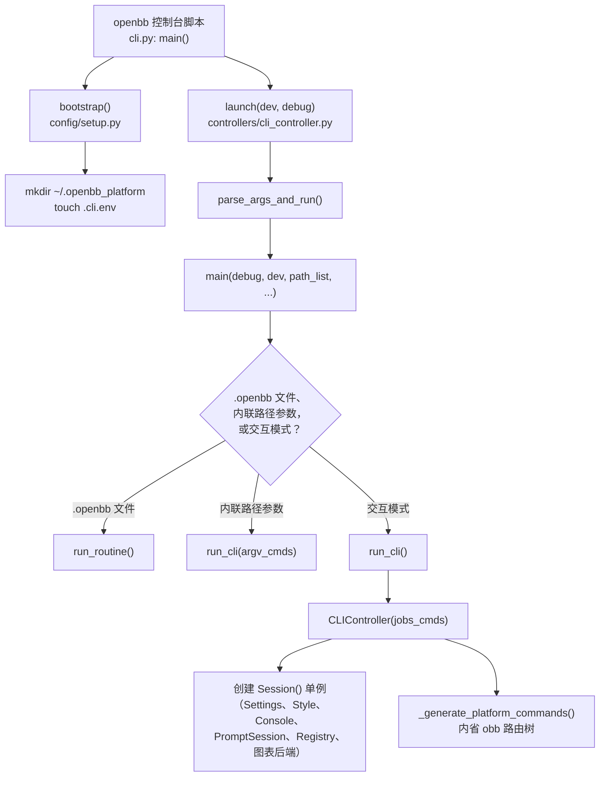
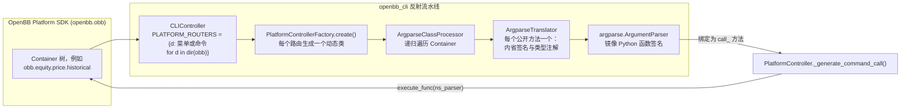

## 主题（Subject）

**OpenBB Platform CLI**（`cli/openbb_cli`）的架构与交互式命令行（UI）设计分析，涵盖：

- 菜单树、命令分发与帮助界面是如何构建与渲染的
- 它基于哪一个终端 UI（TUI）库，以及与 [Textual](https://github.com/Textualize/textual) 的对比
- CLI 层与 OpenBB Platform SDK（`openbb`、`openbb_core`、`openbb_charting`）之间的模块依赖关系

> **关于 `ana` skill 模板的范围说明**：共享的 `ana` skill 指令要求覆盖 Django/Celery 相关内容（媒体生命周期、路由、ORM、任务队列）。但本仓库中 `cli/openbb_cli` 这一主题**完全不涉及 Django 或 Celery**——它是构建在 OpenBB Platform SDK 之上的纯 Python 控制台应用。因此本文档不包含 Django/Celery 章节，而是替换为用户实际请求的 CLI/TUI 专项内容。

## 范围 / 目标（Scope / Goals）

1. 解释 CLI 的进程架构：入口点、启动引导（bootstrap）、单例 `Session`，以及 REPL 主循环。
2. 解释整个命令面（覆盖数十个 OpenBB Platform 扩展的数百条命令）是如何从 Platform SDK **反射式**生成的，而非手写。
3. 明确当前实际使用的 TUI/控制台库，并精确定性其交互模型（行式 REPL vs. 全屏 widget 应用）。
4. 与 [Textual](https://github.com/Textualize/textual) 进行对比，并解释这一设计选择背后可能的工程理由。
5. 为该子系统后续的改动提供图示、配置要点与排障入口。

## Runtime Selection Diagnostics

- runtime_source: auto
- runtime_confidence: 0.97
- runtime_signals: [active-file:pyproject.toml, cli/openbb_cli/*.py, "prompt-toolkit", "rich", argparse, 未发现 Django/Celery 特征]
- runtime_switched: false
- runtime_candidates: python:0.97, other:0.03
- clarification_asked: false
- clarification_question: N/A
- clarification_answer: N/A
- cost_impact_note: 单一语言的 Python 控制台应用，判定无歧义，无需澄清轮次。

## 关键模块地图（Key Module Map）

| 路径 | 角色 |
|---|---|
| [cli/pyproject.toml](../cli/pyproject.toml) | 声明 `openbb` 控制台入口点，并锁定 `prompt-toolkit`、`rich`、`pywry` 版本。 |
| [cli/openbb_cli/cli.py](../cli/openbb_cli/cli.py) | 进程入口点（`main()`），依次调用 `bootstrap()` 与 `launch()`。 |
| [cli/openbb_cli/session.py](../cli/openbb_cli/session.py) | `Session` 单例：持有 `Settings`、`Style`、`Console`、`PromptSession`、`Registry`，以及 Plotly/`pywry` 图表后端。 |
| [cli/openbb_cli/config/setup.py](../cli/openbb_cli/config/setup.py) | `bootstrap()`：创建 `~/.openbb_platform` 目录并 touch `.cli.env` 配置文件。 |
| [cli/openbb_cli/config/constants.py](../cli/openbb_cli/config/constants.py) | 文件系统布局：配置目录、历史文件、样式目录、脚本标签、flair 图标。 |
| [cli/openbb_cli/config/console.py](../cli/openbb_cli/config/console.py) | `Console`：封装 `rich.console.Console`，可选地将帮助文本装入 `rich.panel.Panel`。 |
| [cli/openbb_cli/config/style.py](../cli/openbb_cli/config/style.py) | `Style`：从 `assets/styles/` 加载 `.richstyle.json`（终端配色）与 `.pltstyle`（Plotly 图表配色）。 |
| [cli/openbb_cli/config/menu_text.py](../cli/openbb_cli/config/menu_text.py) | `MenuText`：手工排版定宽、带 bbcode 标签的帮助界面文本（并非 `rich.table.Table`）。 |
| [cli/openbb_cli/config/completer.py](../cli/openbb_cli/config/completer.py) | 基于 `prompt_toolkit.completion.Completer` 手写实现的 `NestedCompleter`/`WordCompleter`，以及会脱敏 `--password`/`--email`/`--pat` 的 `CustomFileHistory`。 |
| [cli/openbb_cli/controllers/base_controller.py](../cli/openbb_cli/controllers/base_controller.py) | 所有菜单共享的抽象 REPL 引擎：输入解析、命令队列、通用动词（`help`、`home`、`quit`、`reset`、`record`/`stop`、`results`）。 |
| [cli/openbb_cli/controllers/cli_controller.py](../cli/openbb_cli/controllers/cli_controller.py) | 根菜单（`/`）。通过内省 `obb`（Platform SDK 根对象）构建顶层菜单/命令；承载主循环 `run_cli()` 与 `.openbb` 例程执行（`exe`）。 |
| [cli/openbb_cli/controllers/platform_controller_factory.py](../cli/openbb_cli/controllers/platform_controller_factory.py) | `PlatformControllerFactory`：为每个 Platform 路由，通过 `type(...)` 动态合成一个控制器**类**。 |
| [cli/openbb_cli/controllers/base_platform_controller.py](../cli/openbb_cli/controllers/base_platform_controller.py) | `PlatformController`：为每个 Platform SDK 函数生成一个 `call_<command>` 方法，执行并渲染/导出/注册其结果。 |
| [cli/openbb_cli/controllers/settings_controller.py](../cli/openbb_cli/controllers/settings_controller.py) | `/settings` 菜单：运行时切换 `Settings` 中的功能开关。 |
| [cli/openbb_cli/controllers/script_parser.py](../cli/openbb_cli/controllers/script_parser.py) | 将 `.openbb` 例程脚本文本解析为命令队列。 |
| [cli/openbb_cli/controllers/choices.py](../cli/openbb_cli/controllers/choices.py) | 通过对每个命令的参数解析钩子打补丁（monkey-patch）来采集其标志位，从而构建补全器的选项映射，且不执行该命令本身。 |
| [cli/openbb_cli/argparse_translator/argparse_translator.py](../cli/openbb_cli/argparse_translator/argparse_translator.py) | `ArgparseTranslator`：内省单个 Python 函数的签名/类型注解，并构建与之匹配的 `argparse.ArgumentParser`。 |
| [cli/openbb_cli/argparse_translator/argparse_class_processor.py](../cli/openbb_cli/argparse_translator/argparse_class_processor.py) | `ArgparseClassProcessor`：递归遍历 OpenBB Platform 路由 `Container`，为每个公开方法构建一个 `ArgparseTranslator`。 |
| [cli/openbb_cli/argparse_translator/obbject_registry.py](../cli/openbb_cli/argparse_translator/obbject_registry.py) | `Registry`：`OBBject` 结果的内存栈，可通过索引（`OBB0`）或用户自定义键寻址，供下游数据处理类命令消费。 |
| [cli/openbb_cli/models/settings.py](../cli/openbb_cli/models/settings.py) | `Settings`（Pydantic `BaseModel`）：功能开关与偏好设置，持久化到 dotenv 文件。 |

## 核心架构（Core Architecture）

### 1. 进程启动引导



### 2. 交互模型：层级式 REPL，而非全屏应用

从架构上看，该 CLI 是一个**行式、层级化的 shell**——在气质上更接近 Cisco IOS CLI、`ipython`，或手写的 `cmd`/`cmd2` shell，而非全屏仪表盘应用：

- 每一个"菜单"（例如 `/equity/`、`/equity/price/`）都是一个 Python 对象（`BaseController` 子类），拥有自己的 `argparse.ArgumentParser`、自己的补全器，以及自己的 `menu()` 循环（[cli/openbb_cli/controllers/base_controller.py:919](../cli/openbb_cli/controllers/base_controller.py#L919)）。
- 导航通过以 `/` 分隔的命令链表达（例如 `/equity/price/historical --symbol AAPL`），由 `parse_and_split_input` 一次性分词后压入各控制器自身的 `queue` 列表，逐条消费（[cli/openbb_cli/controllers/base_controller.py:197](../cli/openbb_cli/controllers/base_controller.py#L197)）。
- 终端**从不**切换到备用屏幕缓冲区，也没有常驻的 widget 树：每条命令只打印一次结果（一个 Rich `Panel`/表格/文本），该输出会保留在正常的回滚历史（scrollback）中，与普通 shell 完全一致。
- 图表根本不在终端内渲染——它们被交给由 `Session._get_backend()` 创建的独立 `pywry` 桌面窗口后端，通过 `OpenBBFigure` 显示（[cli/openbb_cli/session.py:22](../cli/openbb_cli/session.py#L22)）。较大的表格也可以选择弹出到交互式 dataframe 查看器（`USE_INTERACTIVE_DF`），而不是内联打印。

### 3. 反射驱动的命令生成（核心设计思想）

关于这个 CLI 最重要的架构事实是：**几乎没有任何命令是手写的**。每一个菜单、每一个标志位，都是运行时通过内省 OpenBB Platform SDK 的 `obb` 对象树（`openbb_core.app.static.container.Container`）推导出来的。



具体而言：

1. `CLIController` 在类定义时构建 `PLATFORM_ROUTERS = {d: "menu" if not isinstance(getattr(obb, d), BaseModel) else "command" for d in dir(obb)}`（[cli/openbb_cli/controllers/cli_controller.py:50](../cli/openbb_cli/controllers/cli_controller.py#L50)）——正是这行代码决定了 `equity`、`news`、`technical` 等到底是子菜单还是单条命令。
2. 对每一个菜单路由，`PlatformControllerFactory(target, reference=obb.reference["paths"]).create()` 会在运行时通过 `type(ClassName, (PlatformController,), Attributes)` 合成一个**全新的 Python 类**（[cli/openbb_cli/controllers/platform_controller_factory.py:29](../cli/openbb_cli/controllers/platform_controller_factory.py#L29)）——不存在 `EquityController.py` 文件，该类完全在内存中制造出来。
3. `ArgparseClassProcessor` 用 `inspect.getmembers` 递归遍历该路由，对每一个公开的绑定方法、以及每一个嵌套的 `Container` 属性，都包装成一个 `ArgparseTranslator`（[cli/openbb_cli/argparse_translator/argparse_class_processor.py:84](../cli/openbb_cli/argparse_translator/argparse_class_processor.py#L84)）。
4. `ArgparseTranslator` 读取目标函数的 `inspect.signature()` 与 `get_type_hints()`，并构建与之匹配的 `argparse.ArgumentParser`：`Literal[...]` 类型变为 `choices=`，`list[...]` 变为 `nargs="+"`，`Optional[bool]`/`bool` 变为 `action="store_true"`，`Annotated[..., OpenBBField(description=..., choices=...)]` 提供帮助文本与自定义选项（[cli/openbb_cli/argparse_translator/argparse_translator.py:187](../cli/openbb_cli/argparse_translator/argparse_translator.py#L187)）。Pydantic `BaseModel` 类型的参数会被展平为 `--param__field` 形式的点式标志位，并在调用前重新组装（[cli/openbb_cli/argparse_translator/argparse_translator.py:320](../cli/openbb_cli/argparse_translator/argparse_translator.py#L320)）。
5. 执行时，`PlatformController._generate_command_call()` 绑定一个闭包作为 `call_<name>`：解析该行输入，调用 `translator.execute_func(ns_parser)`（其内部调用的是**原始、未经修改**的 Platform SDK 函数），得到一个 `OBBject`，再通过 `print_rich_table`、交互式 dataframe 视图，或弹出图表窗口进行渲染——并可选择将该 `OBBject` 注册进 `session.obbject_registry`，供后续命令以 `OBB0` 或自定义 `--register_key` 引用（[cli/openbb_cli/controllers/base_platform_controller.py:151](../cli/openbb_cli/controllers/base_platform_controller.py#L151)）。

`/equity/price/historical --symbol AAPL` 的完整调用轨迹见 [tui-cli-ANALYSIS-2026-08-03-sequence.puml](tui-cli-ANALYSIS-2026-08-03-sequence.puml)；静态类关系见 [tui-cli-ANALYSIS-2026-08-03-class.puml](tui-cli-ANALYSIS-2026-08-03-class.puml)。

### 4. 渲染流水线（Rich）

- `Console`（[cli/openbb_cli/config/console.py:16](../cli/openbb_cli/config/console.py#L16)）封装 `rich.console.Console`，对于菜单/帮助文本，会将其装入以当前菜单路径为标题、以 CLI 版本为副标题的 `rich.panel.Panel`——除非 `ENABLE_RICH_PANEL` 关闭或 `TEST_MODE` 开启，此时会退化为裸 `print()`，并剥离自定义 bbcode 标签（`[menu]`、`[cmds]`、`[info]`、`[src]`、`[help]`，见 [cli/openbb_cli/config/menu_text.py:13](../cli/openbb_cli/config/menu_text.py#L13) 中的 `RICH_TAGS`）。
- `MenuText`（[cli/openbb_cli/config/menu_text.py:29](../cli/openbb_cli/config/menu_text.py#L29)）**并未**使用 `rich.table.Table` 来渲染帮助界面；它手工将命令名/描述填充到固定宽度（`CMD_NAME_LENGTH=23`、`CMD_DESCRIPTION_LENGTH=65`），并包裹在会被 `rich.console.Theme`（由 `.richstyle.json` 文件构建）映射为颜色的 bbcode 标签中。整个"菜单界面"其实是交给 `Console.print()` 的一个巨大的预格式化多行字符串。
- `Style`（[cli/openbb_cli/config/style.py:15](../cli/openbb_cli/config/style.py#L15)）用同一套主题概念服务**两个**完全不同的渲染后端：`.richstyle.json` 文件为终端文本（Rich）配色，`.pltstyle` 文件为在独立 `pywry` 窗口中渲染的 Plotly 图表配色（colorway、涨跌颜色等）——一个 `Style` 抽象，两个互不相关的渲染器。

### 5. 输入流水线（prompt_toolkit）

- `Session._get_prompt_session()` **仅当 `sys.stdin.isatty()` 为真时**才创建 `prompt_toolkit.PromptSession`（[cli/openbb_cli/session.py:86](../cli/openbb_cli/session.py#L86)）；否则 `prompt_session` 为 `None`，所有控制器都会退化为使用内置 `input()`，不带补全或历史记录。正是这一处判断，使得管道式/非交互执行（CI、`.openbb` 例程回放、集成测试）能够走与交互式使用完全相同的代码路径。
- 命令行编辑、历史记录（`CustomFileHistory`，会在写入 `~/.openbb_platform/.cli.his` 前脱敏 `--password`/`--email`/`--pat`）以及 Tab 补全，均来自 `prompt_toolkit`；不存在备用屏幕布局、鼠标处理或常驻 widget——`PromptSession.prompt()` 每行同步调用一次，与经典 REPL 完全一致。
- 补全选项**并非静态**：`NestedCompleter`/`WordCompleter`（[cli/openbb_cli/config/completer.py:26](../cli/openbb_cli/config/completer.py#L26)）是从零手写的实现（API 形态类似 `prompt_toolkit` 自带的 `NestedCompleter`，但额外维护了已消费标志位与短/长标志别名的状态）。对于 Platform 命令，实际的标志位选项由 `controllers/choices.py` 中的 `build_controller_choice_map` 采集——它通过 `unittest.mock.patch.object` 对 `parse_known_args_and_warn`/`parse_simple_args` 打补丁，并以空参数调用每个 `call_<cmd>`，目的仅仅是拦截其内部构建的 `argparse.ArgumentParser`——真正的命令逻辑从未被执行（[cli/openbb_cli/controllers/choices.py:244](../cli/openbb_cli/controllers/choices.py#L244)）。

### 6. 自动化：`.openbb` 例程脚本

`record`/`stop`（[cli/openbb_cli/controllers/base_controller.py:315](../cli/openbb_cli/controllers/base_controller.py#L315)）会捕获会话中输入的每一行，并写入一个 `.openbb` 文本文件（或上传到 OpenBB Hub）。`exe` 与 `run_scripts()`（[cli/openbb_cli/controllers/cli_controller.py:326](../cli/openbb_cli/controllers/cli_controller.py#L326)）会读回这样的文件，将其各行拼接为一条以 `/` 分隔的命令链，并通过与交互式输入**完全相同**的 `switch()`/`queue` 引擎执行。换句话说，"自动化"本质上是通过 REPL 解析器对按键输入的字面重放，而不是一个独立的脚本 API 或 DSL 解释器。

## 关键数据模型（仅描述，不涉及改动）

- **`Settings`**（[cli/openbb_cli/models/settings.py:22](../cli/openbb_cli/models/settings.py#L22)）—— 一个 Pydantic `BaseModel`，包含功能开关（`USE_PROMPT_TOOLKIT`、`ENABLE_RICH_PANEL`、`TOOLBAR_HINT`、`USE_INTERACTIVE_DF` 等）与偏好设置（`TIMEZONE`、`FLAIR`、`RICH_STYLE`、`N_TO_KEEP_OBBJECT_REGISTRY` 等）。`model_validator(mode="before")` 在每次构造时从 `~/.openbb_platform/.cli.env` 的 dotenv 文件加载已有值；`set_item()` 会同时写入内存中的属性与 dotenv 键，因此在 `/settings` 菜单中做的切换能够在重启后保留。
- **`Registry` / `OBBject` 栈**（[cli/openbb_cli/argparse_translator/obbject_registry.py:9](../cli/openbb_cli/argparse_translator/obbject_registry.py#L9)）—— 一个进程内、非持久化的栈（最近的在最前），存放 `OBBject` 结果，容量受 `N_TO_KEEP_OBBJECT_REGISTRY` 限制。条目可通过栈内索引（`OBB0`、`OBB1`……）或用户自定义的 `--register_key` 寻址，这正是 `technical`/`quantitative`/`econometrics` 等命令能够在不重新拉取数据的情况下，对上一条命令的输出进行操作的原因。
- **`ArgparseTranslator`/`ArgparseClassProcessor`** 生成的产物**不会被持久化**——每次 CLI 进程启动时都会从当前存活的 OpenBB Platform SDK 重新构建，因此命令面始终与当前环境中已安装的 Platform 扩展保持一致（不存在需要手动同步的静态命令清单）。

## TUI 库：`prompt_toolkit` + `rich`（并非 Textual）

### CLI 实际使用的技术栈

直接确认自 [cli/pyproject.toml](../cli/pyproject.toml)：

```toml
dependencies = [
    "openbb[all]",
    "prompt-toolkit>=3.0.50,<4.0.0",
    "rich>=14.0.0,<15.0.0",
    "python-dotenv>=1.0.1,<2.0.0",
    "openpyxl>=3.1.5,<4.0.0",
    "pywry>=0.6.2,<0.7.0",
]
```

- **`prompt_toolkit`** —— 仅使用其**行编辑**这一层：`PromptSession.prompt()` 读取单行输入，`Completer`/`Completion` 提供 Tab 补全，`FileHistory` 提供命令历史，`Style`/`HTML` 用于底部单行工具栏。`prompt_toolkit` 中更底层的 `layout`/全屏 `Application` API（也就是 `prompt_toolkit` *能够*构建全屏应用的那部分）在本代码库中**完全没有使用**。
- **`rich`** —— 仅用于**一次性渲染并返回**的输出：`rich.console.Console.print()`、`rich.panel.Panel`、`rich.table.Table`（在 `print_rich_table` 中使用）、`rich.console.Theme`。Rich 从不接管终端或维护常驻画面；每次调用渲染一次后即把控制权交还给 shell 正常的回滚缓冲区。
- **`pywry`** —— 一个独立的、非终端的桌面窗口后端，仅用于 Plotly 图表弹窗（`OpenBBFigure`），完全不属于终端 UI 的一部分。

**`cli/pyproject.toml` 与 `cli/openbb_cli/` 中的任何地方都没有 Textual 依赖。**

### 与 Textual 的差异

| 维度 | OpenBB CLI（`prompt_toolkit` + `rich`） | [Textual](https://github.com/Textualize/textual) |
|---|---|---|
| 屏幕模型 | 普通回滚缓冲区；每条命令像 shell 一样追加输出 | 备用屏幕缓冲区；一个常驻、可重绘的画面 |
| UI 单元 | 每条命令对应一个 `argparse.ArgumentParser` + 一个只打印一次的 Rich 可渲染对象 | 一棵长期存活的 `Widget` 树（按钮、表格、树形控件、输入框），配合类 CSS 样式 |
| 更新模型 | 每条命令渲染一次，无状态 | 响应式：widget 随状态变化重新渲染，支持动画与异步消息传递 |
| 输入模型 | 每轮阻塞式调用一次 `PromptSession.prompt()`，单行输入 | 完整的键盘/鼠标事件循环，跨 widget 的焦点管理与按键绑定 |
| 管道 / 重定向 | 无需改动即可工作——与普通用户可以 `> file`、`| less`、或回滚查看的 stdout 流完全一致 | 意义不同——备用屏幕并非为回滚/重定向设计 |
| 非交互 / 无头执行 | 当 `stdin` 不是 TTY 时自动退化为内置 `input()`（[cli/openbb_cli/session.py:86](../cli/openbb_cli/session.py#L86)）；`.openbb` 脚本通过完全相同的代码路径回放 | 需要单独的 `Pilot`/无头测试 API 才能在没有真实终端的情况下驱动 |
| 命令面的可扩展性 | argparse 树直接通过反射从 Python 函数签名生成——每新增一个 Platform SDK 端点，几乎零额外编写成本 | 每个界面/表单通常需要手工编写为 widget 布局；不存在直接的"签名 → widget"代码生成等价物 |
| 鼠标 / 可点击控件 | 无——一切都是行输入；图表弹出到独立的 `pywry` 窗口而非终端内渲染 | 一等公民支持：按钮、可点击行、可滚动面板、实时仪表盘 |
| 控制台层自身的维护成本 | 一个约 400 行、手写的 `NestedCompleter`/`WordCompleter`，加上手工排版的 `MenuText`——由团队自行维护，状态跟踪逻辑不简单 | 框架维护的布局/widget/响应式系统，但需要学习和依赖更大的框架表面 |

### 为何如此设计（从代码库推断，而非依据外部历史资料）

1. **命令面是反射生成的，而 argparse 恰是这种反射的天然落点。** 整个菜单树是通过内省 Python 函数签名（`inspect.signature`、`get_type_hints`）并将其转换为 `argparse.ArgumentParser` 实例来生成的（[cli/openbb_cli/argparse_translator/argparse_translator.py:320](../cli/openbb_cli/argparse_translator/argparse_translator.py#L320)）。argparse 那种声明式的、基于标志位的模型，几乎可以 1:1 映射到一个 Python 函数签名。而在全屏框架中，并不存在同样直接的"签名 → widget"映射——每一个 Textual 界面都需要（或需要新的工具去代码生成）被手工编写成一个 widget 布局，而不是一个 parser。
2. **保留回滚历史的输出，是数据研究类终端的一项功能性需求。** 由于 Rich 每条命令只向正常缓冲区渲染一次，用户能够保留一份会话中拉取过的每张表格/结果的可滚动记录——这正是 `results`/`Registry` 栈这一概念所依赖的（把"倒数第 3 张表"引用为 `OBB2`）。Textual 应用的备用屏幕并非为同样的"回滚并引用"模式而设计。
3. **产品中"视觉分量重"的部分（图表、大型交互式表格）被有意地推到终端**之外****，交给 `pywry` 桌面窗口（[cli/openbb_cli/session.py:22](../cli/openbb_cli/session.py#L22)）或交互式 dataframe 查看器渲染，而不是作为终端内 widget 渲染。既然做了这样的拆分，终端一侧就只需要"带样式的静态文本 + 行编辑"，这恰好就是 Rich + prompt_toolkit 所提供的——终端从来就不打算成为 Textual 应用想要独占的那个常驻可视化界面。
4. **非交互执行必须是一等模式，而非特例分支。** `.openbb` 例程脚本、CI 集成测试、管道输入，全部退化为同一个基于 `input()` 的循环，且没有为"无头模式"额外分支代码（[cli/openbb_cli/session.py:86](../cli/openbb_cli/session.py#L86)、[cli/openbb_cli/controllers/cli_controller.py:657](../cli/openbb_cli/controllers/cli_controller.py#L657)）。若要在全屏 Textual `App` 之上实现同样的保证，则需要其独立的无头/`Pilot` 测试模型，而不能简单地"用管道 stdin 调用同一个函数"。
5. **接受的取舍**：这一设计放弃了鼠标交互、实时刷新的仪表盘，以及框架维护的 widget/布局系统，换来的是一个类 shell、可脚本化、对回滚历史友好的 REPL——其整个命令面在每次安装新的 OpenBB Platform 扩展时都能免费重新生成。这种取舍之所以成立，是因为产品实际的 UI 需求是"参数解析 + 带样式文本 + 偶尔弹出的外部图表窗口"，而不是"一个常驻的屏上仪表盘"——而这正是本代码库所实现的情形。

## 关键配置点（Key Configuration Points）

| 配置 / 路径 | 位置 | 作用 |
|---|---|---|
| `~/.openbb_platform/.cli.env` | [cli/openbb_cli/config/constants.py:12](../cli/openbb_cli/config/constants.py#L12) | 以 dotenv 持久化的 `Settings`（功能开关、偏好设置）；每个键都带 `OPENBB_` 前缀。 |
| `~/.openbb_platform/.cli.his` | [cli/openbb_cli/config/constants.py:13](../cli/openbb_cli/config/constants.py#L13) | 提示历史文件（`CustomFileHistory`），写入前会脱敏 `--password`/`--email`/`--pat` 的值。 |
| `assets/styles/{default,user}/*.richstyle.json` | [cli/openbb_cli/config/style.py:83](../cli/openbb_cli/config/style.py#L83) | 终端配色主题（`RICH_STYLE` 设置项选择其一，默认为 `"dark"`）。 |
| `Settings.USE_PROMPT_TOOLKIT` | [cli/openbb_cli/models/settings.py:71](../cli/openbb_cli/models/settings.py#L71) | 整体开关补全/历史功能；关闭后即便处于真实 TTY 也会退化为内置 `input()`。 |
| `Settings.ENABLE_RICH_PANEL` | [cli/openbb_cli/models/settings.py:83](../cli/openbb_cli/models/settings.py#L83) | 切换菜单/帮助文本是否使用带边框的 `Panel`，还是普通 `print()`。 |
| `Settings.TOOLBAR_HINT` | [cli/openbb_cli/models/settings.py:89](../cli/openbb_cli/models/settings.py#L89) | 切换 `BaseController.menu()` 中底部单行按键提示条的显示（[cli/openbb_cli/controllers/base_controller.py:966](../cli/openbb_cli/controllers/base_controller.py#L966)）。 |
| `Settings.N_TO_KEEP_OBBJECT_REGISTRY` / `N_TO_DISPLAY_OBBJECT_REGISTRY` | [cli/openbb_cli/models/settings.py:115](../cli/openbb_cli/models/settings.py#L115) | 限制 `Registry` 栈的大小，以及帮助界面上展示的缓存结果数量。 |
| `--dev` CLI 参数 | [cli/openbb_cli/controllers/cli_controller.py:933](../cli/openbb_cli/controllers/cli_controller.py#L933) | 将 `HUB_URL`/`BASE_URL` 指向 OpenBB 的开发后端而非生产环境。 |
| `-d` / `--debug` CLI 参数 | [cli/openbb_cli/controllers/cli_controller.py:844](../cli/openbb_cli/controllers/cli_controller.py#L844) | 暴露未知 CLI 参数与原始异常，而不是静默退出/吞掉它们。 |

## 常见故障与排障入口（Common Failure Cases and Troubleshooting Entry Points）

| 现象 | 可能原因 | 排查位置 |
|---|---|---|
| 即便处于真实终端，也没有 Tab 补全/历史记录 | `Settings.USE_PROMPT_TOOLKIT` 为 `False`，或 `sys.stdin.isatty()` 返回 `False`（例如在会重定向 stdin 的包装器中运行） | [cli/openbb_cli/session.py:86](../cli/openbb_cli/session.py#L86) 的 `_get_prompt_session()` |
| 新安装的 OpenBB Platform 扩展命令未出现在 CLI 中 | 该扩展没有安装到与 `openbb-cli` 相同的环境中，导致 `dir(obb)` 无法发现它；或该路由只暴露了 `ArgparseClassProcessor` 会跳过的私有/`_` 前缀方法 | [cli/openbb_cli/argparse_translator/argparse_class_processor.py:91](../cli/openbb_cli/argparse_translator/argparse_class_processor.py#L91) |
| 某个命令的标志位无法正确补全选项 | `choices.py` 中 `build_controller_choice_map` 的补丁未能恰好拦截到该命令的一次 parser 调用（在 `DEBUG_MODE` 下会抛出/记录 `AssertionError`） | [cli/openbb_cli/controllers/choices.py:244](../cli/openbb_cli/controllers/choices.py#L244) 的 `_get_argument_parser()` |
| 会话中途 `results`/`OBB<n>` 引用失效 | `Registry` 在超过 `N_TO_KEEP_OBBJECT_REGISTRY` 后淘汰了最旧的条目，或该命令从未设置 `store_obbject`/`register_obbject` | [cli/openbb_cli/argparse_translator/obbject_registry.py:60](../cli/openbb_cli/argparse_translator/obbject_registry.py#L60) 的 `remove()`；[cli/openbb_cli/controllers/base_platform_controller.py:182](../cli/openbb_cli/controllers/base_platform_controller.py#L182) |
| `.openbb` 例程回放结果与录制时不一致 | 例程脚本是对命令字符串的字面重放；Platform SDK 默认值、数据提供方可用性，或菜单结构在录制与回放之间发生变化都会改变行为 | [cli/openbb_cli/controllers/cli_controller.py:657](../cli/openbb_cli/controllers/cli_controller.py#L657) 的 `run_scripts()`；[cli/openbb_cli/controllers/script_parser.py](../cli/openbb_cli/controllers/script_parser.py) |
| 图表始终不出现 / 报后端相关错误 | 图表通过独立的 `pywry` 桌面进程渲染，而非终端内渲染；检查 `Session._get_backend()`，以及当前环境（例如无头 CI）是否具备可用的显示/GUI 后端 | [cli/openbb_cli/session.py:22](../cli/openbb_cli/session.py#L22) |
| 敏感值（密码/邮箱/PAT）意外可见 | `CustomFileHistory.sanitize_input` 只对 `--password`、`--email`、`--pat` 做脱敏；任何其他携带密钥的标志位名称都会以明文写入 `.cli.his` | [cli/openbb_cli/config/completer.py:410](../cli/openbb_cli/config/completer.py#L410) |

### 可观测性证据（Observability Evidence）

- 该子系统**没有后台工作进程、任务队列或异步任务运行器**——一切都在单一 REPL 进程内同步执行，直接响应用户输入的命令。因此不存在需要记录的 Celery/队列式可观测性接口。
- 最接近的外部依赖边界是：（1）OpenBB Platform SDK 调用本身（`translator.execute_func` → `obb.<router>.<method>(**kwargs)`），其异常会被捕获并内联打印（`except Exception as e: session.console.print(f"[red]{e}[/]")` —— [cli/openbb_cli/controllers/base_platform_controller.py:273](../cli/openbb_cli/controllers/base_platform_controller.py#L273)）；（2）用于例程上传/登录的 OpenBB Hub HTTP 调用（`controllers/hub_service.py`）；（3）`pywry` 图表后端进程。`-d`/`--debug` 模式是排障时暴露原本会被吞掉的异常与未知 CLI 参数的主要手段。
- 本次分析**未**实际交互式运行该 CLI（以捕获真实终端截图/文本记录）：这需要对整个 monorepo 工作区执行 `uv sync`，而本机 `C:` 盘容量已使用 99%，仅剩约 4.7 GB 可用空间——为了一项非必要的验证步骤而尝试这样做，存在耗尽磁盘空间的风险。以上所有结论均来自对本文档中所链接源文件的静态阅读；文中任何"观测到的行为"式表述，应理解为"代码直接暗示的行为"，而非真实抓取的终端截图。

## 图示（Diagrams）

- 静态类关系：[tui-cli-ANALYSIS-2026-08-03-class.puml](tui-cli-ANALYSIS-2026-08-03-class.puml)
- 命令分发时序：[tui-cli-ANALYSIS-2026-08-03-sequence.puml](tui-cli-ANALYSIS-2026-08-03-sequence.puml)

## 相关链接（Related Links）

- [cli/README.md](../cli/README.md) —— OpenBB Platform CLI 面向用户的安装/使用说明文档。
- [cli/pyproject.toml](../cli/pyproject.toml) —— 依赖与入口点声明。
- 撰写本文档时，本仓库中未发现任何既有的 `docs/*ANALYSIS*` 文件，因此本文档是一个全新主题，而非对既有分析的追加。

## 文档说明（语言决策依据）

依据本仓库 `.claude/rules/language-policy.md`：当用户未显式指定语言时（本次未提供 `lan=` 参数），`docs/*.md` 分析类文档默认采用**中英双语、内容镜像**的输出方式，这一规则覆盖了 `ana` skill 自身"默认英文、单文件"的简单默认行为——但仅覆盖*语言*这一维度；本文档的*文件命名*仍遵循 `ana`/`umlgen` skill 的约定（`{sub}-ANALYSIS-{date}-{lang}.md`），而非 `language-policy.md` 的命名约定（`<name>.md` / `<name>.en.md`），因为 `ana` skill 自身明确给出的输出要求章节，是本次命令的可操作指令集，且中英两个文件仍需归属于同一个 `{sub}-ANALYSIS-{date}` 基础文件族。对应的英文镜像文档为 [tui-cli-ANALYSIS-2026-08-03-en.md](tui-cli-ANALYSIS-2026-08-03-en.md)。
